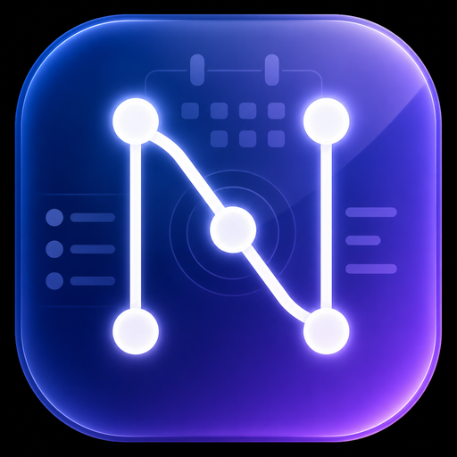

<p align="center">
  
</p>

<h1 align="center">Nexus Web</h1>

<p align="center">
  <strong>Nexus 모바일/웹 버전</strong><br>
  어디서든 접속 가능한 개인 대시보드
</p>

<p align="center">
  
  
  
  
</p>

<p align="center">
  <a href="https://nexus-web-black-gamma.vercel.app">Live Demo</a>
</p>

---

## Overview

Nexus 데스크톱 앱의 웹 버전입니다. PC 앱과 Supabase를 통해 실시간 동기화됩니다.

- **PC에서 메모 작성** → 2초 내 폰에서 확인
- **폰에서 일정 추가** → 앱에서 바로 반영
- **PWA 지원** → 홈 화면에 추가하면 앱처럼 사용

## Features

- Block editor (메모, 할 일, 코드, 인용 등)
- Spreadsheet (시트)
- Calendar (일정 관리)
- PDF export
- Real-time sync (2초 간격)
- Web notifications (일정 알림)
- Mobile responsive + FAB toolbar
- JARVIS-inspired dark theme

## Architecture

```
Phone/Browser  ──→  Vercel (Static HTML)
                         │
                    Supabase (Cloud DB)
                         │
Desktop App    ──→  Local JSON + Sync
```

## Deploy

GitHub push → Vercel 자동 배포

```bash
git add -A && git commit -m "update" && git push
# → Vercel이 자동으로 재배포
```

## License

Private — Personal use only.
